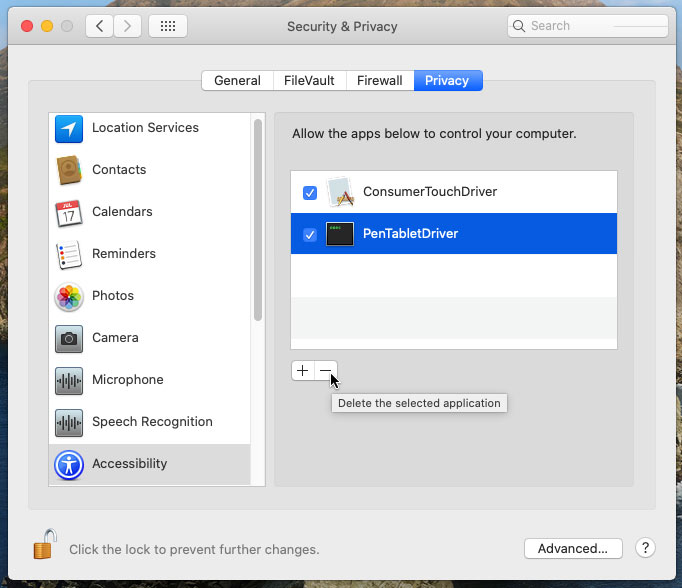
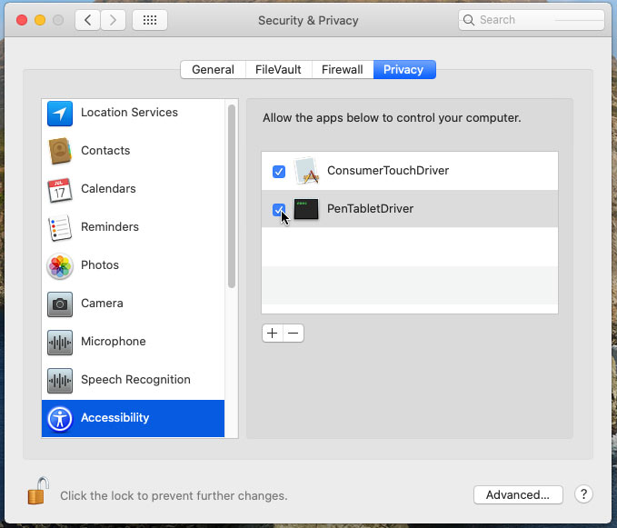

# Controladores corregidos para tabletas Wacom Bamboo, Graphire, Intuos 1, 2 y 3 y Cintiq 1.ª generación en macOS 10.15 Catalina

Los controladores de Wacom para tabletas Bamboo, Graphire, Intuos 1, 2 y 3 y Cintiq de 1.ª generación tienen errores que
hacen que ya no funcionen en macOS 10.15 Catalina, y Wacom ya no actualiza estos controladores.
¡Afortunadamente, pude corregir los errores y hacer que los controladores funcionen nuevamente!

Mi controlador corregido Bamboo (v5.3.7-6) es compatible con estas tabletas:

- CTE-450, CTE-650 - Bamboo Fun / Bamboo Art Master (2007)
- CTE-460, CTE-660 - Bamboo One Pen
- CTF-430 - Bamboo One
- CTH-300, CTH300, CTH301K - Bamboo Pad
- CTH-460, CTH-660 - Bamboo Pen and Touch
- CTH-461 - Bamboo Fun Pen and Touch / Bamboo Craft / Bamboo Fun Special Edition
- CTH-470 - Bamboo Capture / Bamboo Pen & Touch / Bamboo Create
- CTH-661 - Bamboo Fun / Bamboo Art Master (2009) / Bamboo Fun Pen and Touch
- CTH-670 - Bamboo Create
- CTL-460, CTL-660 - Bamboo Pen 
- CTL-470 - Bamboo Connect / Bamboo Pen
- CTT-460 - Bamboo Touch
- MTE-450 - Bamboo

Mi controlador corregido Graphire 1 & 2 e Intuos 1 & 2 (v6.1.6-4) es compatible con estas tabletas:

- ET-0405-U - Graphire / Graphire 1 (USB)
- ET-0405-R - Graphire / Graphire 1 (Serial)
- ET-0405A - Graphire 2
- GD-0405-U, GD-0608-U, GD-0912-U, GD-1212-U, GD-1218-U - Intuos (USB) (1998)
- GD-0405-R, GD-0608-R, GD-0912-R, GD-1212-R, GD-1218-R - Intuos (Serial) (1998)
- XD-0405-U, XD-0608-U, XD-0912-U, XD-1212-U, XD-1218-U - Intuos 2 (USB)
- XD-0405-R, XD-0608-R, XD-0912-R, XD-1212-R, XD-1218-R - Intuos 2 (Serial)

Mi controlador corregido Graphire 3 (v5.2.6-5) es compatible con estas tabletas:

- CTE-430, CTE-630 - Graphire 3
- CTE-630BT - Graphire 3 Wireless

Mi controlador corregido Graphire 4 (v5.3.0-3) es compatible con estas tabletas:

- CTE-440, CTE-640 - Graphire 4

Mi controlador corregido de Intuos 3 y Cintiq (v6.3.15-3) es compatible con estas tabletas:

- PTZ-430, PTZ-630, PTZ-630SE, PTZ-631W, PTZ-930, PTZ-1230, PTZ-1231W - Intuos 3
- DTZ-2100 - Cintiq 21UX 1.ª generación
- DTZ-2000 - Cintiq 20WSX

[🇳🇿 English instructions](Readme.md)   
[🇧🇷 / 🇵🇹 Instruções em português](Readme.pt-BR.md)  
[🇯🇵 日本語で表示](Readme.ja-JP.md)   
[🇷🇺 Инструкция на русском языке](Readme.ru-RU.md)  
[🇪🇸 Instrucciones en español](Readme.es.md)   
[🇵🇱 Instrukcja po polsku](Readme.pl.md)   
[🇫🇷 Instructions en français](Readme.fr-FR.md)   

## Instala el controlador corregido

Primero, descargue el controlador correcto para su tableta:

- [Controlador corregido v6.1.6-4 para tabletas Graphire 1 y 2 e Intuos 1 y 2](https://github.com/thenickdude/wacom-driver-fix/releases/download/patch-9/Install-Wacom-Tablet-6.1.6-4-patched.pkg)
- [Controlador corregido v5.2.6-5 para Graphire 3](https://github.com/thenickdude/wacom-driver-fix/releases/download/patch-9/Install-Wacom-Tablet-5.2.6-5-patched.pkg)
- [Controlador corregido v5.3.0-3 para Graphire 4](https://github.com/thenickdude/wacom-driver-fix/releases/download/patch-9/Install-Wacom-Tablet-5.3.0-3-patched.pkg)
- [Controlador corregido v5.3.7-6 para Bamboo](https://github.com/thenickdude/wacom-driver-fix/releases/download/patch-9/Install-Wacom-Tablet-5.3.7-6-patched.pkg)
- [Controlador corregido v6.3.15-3 para Intuos 3 y Cintiq](https://github.com/thenickdude/wacom-driver-fix/releases/download/patch-9/Install-Wacom-Tablet-6.3.15-3-patched.pkg)

Ejecute el instalador para instalar el controlador.

Ahora necesitamos eliminar los permisos que quedaron del controlador anterior:

- Haga clic en el menú de Apple, luego en Preferencias del sistema, Seguridad y Privacidad
- En la pestaña Privacidad, seleccione Accesibilidad y haga clic en el candado en la parte inferior izquierda para realizar cambios. Se le pedirá que ingrese sus credenciales de inicio de sesión.
- Seleccione los elementos de Wacom en la lista (PenTabletDriver, ConsumerTouchDriver, WacomTabletSpringboard, etc.) y haga clic en el botón "-" para eliminarlos.
- Haz lo mismo en la página "Monitorización de entrada"
- Reinicia la computadora

Ahora podemos agregar permisos para el nuevo controlador corregido:

- Toque la tableta con la punta del lápiz una vez
- Haga clic en el menú de Apple, luego en Preferencias del sistema, Seguridad y Privacidad
- En la pestaña Privacidad, seleccione Accesibilidad y haga clic en el candado en la parte inferior izquierda para realizar cambios. Se le pedirá que ingrese sus credenciales de inicio de sesión.
- Asegúrese de que todos los elementos de Wacom en la lista (PenTabletDriver, ConsumerTouchDriver, WacomTabletSpringboard, etc.) estén marcados
- Haz lo mismo en la página "Monitorización de entrada"

¡Tu tableta debería estar funcionando ahora! Es posible que deba reiniciar la computadora una vez más.

## Ayúdame

Si ha disfrutado de que su tableta vuelva a funcionar, ¡considere enviarme una donación!

Esto me ayudará a financiarme para desarrollar aún más estos controladores de dispositivos.