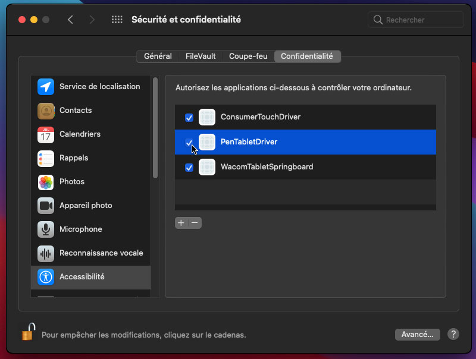

## Correction des pilotes drivers pour les tablettes Wacom Bamboo, Graphire, Intuos 1, 2, 3 et Cintiq 1ère génération sur macOS Catalina / Big Sur

Les pilotes Wacom pour Bamboo, Graphire, Intuos 1, 2 et 3 et Cintiq 1ère génération sont buggés, ce qui
les empêchent de fonctionner sur macOS 10.15 Catalina ou macOS 11 Big Sur, et Wacom ne met plus à jour ces pilotes.
Heureusement, j'ai pu corriger les bugs et remettre les pilotes en marche!

Mon pilote **Bamboo** corrigé (v5.3.7-6) prend en charge les tablettes suivantes:

- CTE-450, CTE-650 - Bamboo Fun / Bamboo Art Master (2007)
- CTE-460, CTE-660 - Bamboo One Pen
- CTF-430 - Bamboo One
- CTH-300, CTH300, CTH301K - Bamboo Pad
- CTH-460, CTH-660 - Bamboo Pen and Touch
- CTH-461 - Bamboo Fun Pen and Touch / Bamboo Craft / Bamboo Fun Special Edition
- CTH-470 - Bamboo Capture / Bamboo Pen & Touch / Bamboo Create
- CTH-661 - Bamboo Fun / Bamboo Art Master (2009) / Bamboo Fun Pen and Touch
- CTH-670 - Bamboo Create
- CTL-460, CTL-660 - Bamboo Pen
- CTL-470 - Bamboo Connect / Bamboo Pen
- CTT-460 - Bamboo Touch
- MTE-450 - Bamboo

Mon pilote corrigé **Graphire 1 & 2** et **Intuos 1 & 2** (v6.1.6-4) prend en charge ces tablettes:

- ET-0405-U - Graphire / Graphire 1 (USB)
- ET-0405-R - Graphire / Graphire 1 (Serial)
- ET-0405A - Graphire 2
- GD-0405-U, GD-0608-U, GD-0912-U, GD-1212-U, GD-1218-U - Intuos (USB) (1998)
- GD-0405-R, GD-0608-R, GD-0912-R, GD-1212-R, GD-1218-R - Intuos (Serial) (1998)
- XD-0405-U, XD-0608-U, XD-0912-U, XD-1212-U, XD-1218-U - Intuos 2 (USB)
- XD-0405-R, XD-0608-R, XD-0912-R, XD-1212-R, XD-1218-R - Intuos 2 (Serial)

Mon pilote corrigé **Graphire 3** (v5.2.6-5) prend en charge les tablettes suivantes:

- CTE-430, CTE-630 - Graphire 3
- CTE-630BT - Graphire 3 Wireless

Mon pilote corrigé **Graphire 4** (v5.3.0-3) prend en charge ces tablettes:

- CTE-440, CTE-640 - Graphire 4

Mon pilote corrigé **Intuos 3** et **Cintiq** (v6.3.15-3) prend en charge ces tablettes:

- PTZ-430, PTZ-630, PTZ-630SE, PTZ-631W, PTZ-930, PTZ-1230, PTZ-1231W - Intuos 3
- DTZ-2100 - Cintiq 21UX 1st Gen.
- DTZ-2000 - Cintiq 20WSX

[🇳🇿 English instructions](Readme.md)  
[🇧🇷 / 🇵🇹 Instruções em português](Readme.pt-BR.md)   
[🇯🇵 日本語で表示](Readme.ja-JP.md)  
[🇷🇺 Инструкция на русском языке](Readme.ru-RU.md)  
[🇪🇸 Instrucciones en español](Readme.es.md)

## Installez le pilote corrigé

Tout d'abord, téléchargez le pilote adapté à votre tablette:

- [Pilote fixe v6.1.6-4 pour Graphire 1 & 2 et Intuos 1 & 2](https://github.com/thenickdude/wacom-driver-fix/releases/download/patch-9/Install-Wacom-Tablet-6.1.6-4-patched.pkg)
- [Pilote fixe v5.2.6-5 pour Graphire 3](https://github.com/thenickdude/wacom-driver-fix/releases/download/patch-9/Install-Wacom-Tablet-5.2.6-5-patched.pkg)
- [Pilote fixe v5.3.0-3 pour Graphire 4](https://github.com/thenickdude/wacom-driver-fix/releases/download/patch-9/Install-Wacom-Tablet-5.3.0-3-patched.pkg)
- [Pilote fixe v5.3.7-6 pour Bamboo](https://github.com/thenickdude/wacom-driver-fix/releases/download/patch-9/Install-Wacom-Tablet-5.3.7-6-patched.pkg)
- [Pilote fixe v6.3.15-3 pour Intuos 3 et Cintiq](https://github.com/thenickdude/wacom-driver-fix/releases/download/patch-9/Install-Wacom-Tablet-6.3.15-3-patched.pkg)

Exécutez le programme d'installation pour installer le pilote.

Il faut maintenant supprimer les autorisations restantes de l'ancien pilote:

- Cliquez sur le menu Pomme, puis sur Préférences Système, Sécurité et confidentialité
- Dans l'onglet Confidentialité, sélectionnez Accessibilité et cliquez sur le cadenas en bas à gauche pour apporter des modifications. Vous serez invité à entrer vos identifiants de connexion.
- Sélectionnez les éléments Wacom dans la liste (PenTabletDriver, ConsumerTouchDriver, WacomTabletSpringboard, etc.) et cliquez sur le bouton "-" pour les supprimer.
- Faites de même sur la page "Surveillance de l’entrée"
- Redémarrez l'ordinateur

Maintenant, nous pouvons ajouter des autorisations pour le nouveau pilote corrigé:

- Touchez une fois la tablette avec la pointe du stylet
- Cliquez sur le menu Pomme, puis sur Préférences Système, Sécurité et Confidentialité
- Dans l'onglet Confidentialité, sélectionnez Accessibilité et cliquez sur le cadenas en bas à gauche pour apporter des modifications. Vous serez invité à entrer vos identifiants de connexion.
- Assurez-vous que tous les éléments Wacom de la liste (PenTabletDriver, ConsumerTouchDriver, WacomTabletSpringboard, etc.) sont cochés
- Faites de même sur la page " Surveillance de l’entrée "

Votre tablette devrait maintenant fonctionner! Vous devrez peut-être redémarrer votre ordinateur une nouvelle fois.

## Aidez-moi

Si vous avez apprécié que votre tablette fonctionne à nouveau, pensez à m'envoyer un don!

Cela m'aidera à me financer et à continuer à corriger ces pilotes.