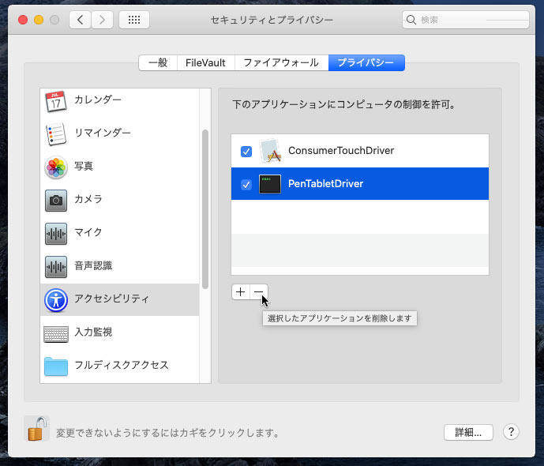
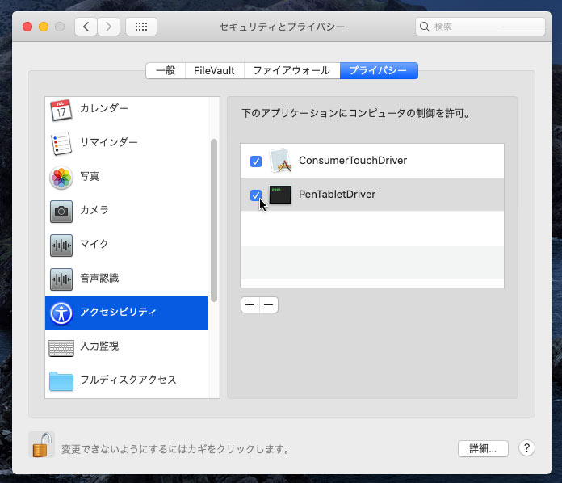

# WACOM Bamboo, Graphire, Intuos 1+2+3, Cintiq第１世代タブレットmacOS 10.15修正ドライバー

WACOM Bamboo, Graphire, Intuos 1+2+3及びCintiq第１世代タブレットがmacOS 10.15 Catalinaでは[バグがある](https://github.com/thenickdude/wacom-driver-fix/blob/master/Readme.md#technical-details-of-the-bugs)為、
近日起動しなくなりました。もしお困りの方は、下記修正ドライバーの作成により再度起動できる様になりましたので是非ご使用ください。

Bamboo修正ドライバー (v5.3.7-6) 対応デバイス：

- CTE-450, CTE-650 - Bamboo Fun / Bamboo Art Master (2007)
- CTE-460, CTE-660 - Bamboo One Pen
- CTF-430 - Bamboo One
- CTH-300, CTH300, CTH301K - Bamboo Pad
- CTH-460, CTH-660 - Bamboo Pen and Touch
- CTH-461 - Bamboo Fun Pen and Touch / Bamboo Craft / Bamboo Fun Special Edition
- CTH-470 - Bamboo Capture / Bamboo Pen & Touch / Bamboo Create
- CTH-661 - Bamboo Fun / Bamboo Art Master (2009) / Bamboo Fun Pen and Touch
- CTH-670 - Bamboo Create
- CTL-460, CTL-660 - Bamboo Pen 
- CTL-470 - Bamboo Connect / Bamboo Pen
- CTT-460 - Bamboo Touch
- MTE-450 - Bamboo

Graphire 1+2/Intuos 1+2修正ドライバー (v6.1.6-4) 対応デバイス：

- ET-0405-U - Graphire / Graphire 1 (USB)
- ET-0405-R - Graphire / Graphire 1 (Serial)
- ET-0405A - Graphire 2
- GD-0405-U, GD-0608-U, GD-0912-U, GD-1212-U, GD-1218-U - Intuos (USB) (1998)
- GD-0405-R, GD-0608-R, GD-0912-R, GD-1212-R, GD-1218-R - Intuos (Serial) (1998)
- XD-0405-U, XD-0608-U, XD-0912-U, XD-1212-U, XD-1218-U - Intuos 2 (USB)
- XD-0405-R, XD-0608-R, XD-0912-R, XD-1212-R, XD-1218-R - Intuos 2 (Serial)

Graphire 3修正ドライバー (v5.2.6-5) 対応デバイス：

- CTE-430, CTE-630 - Graphire 3
- CTE-630BT - Graphire 3 Wireless

Graphire 4修正ドライバー (v5.3.0-3) 対応デバイス：

- CTE-440, CTE-640 - Graphire 4

Intuos/Cintiq修正ドライバー (v6.3.15-3) 対応デバイス：

- PTZ-430, PTZ-630, PTZ-630SE, PTZ-631W, PTZ-930, PTZ-1230, PTZ-1231W - Intuos 3
- DTZ-2100 - Cintiq 21UX 1st Gen.
- DTZ-2000 - Cintiq 20WSX

[🇳🇿 English instructions](Readme.md)   
[🇦🇺 Simplified English instructions](Readme.en-simple.md)   
[🇧🇷 / 🇵🇹 Instruções em português](Readme.pt-BR.md)  
[🇷🇺 Инструкция на русском языке](Readme.ru-RU.md)   
[🇪🇸 Instrucciones en español](Readme.es.md)   
[🇵🇱 Instrukcja po polsku](Readme.pl.md)   
[🇫🇷 Instructions en français](Readme.fr-FR.md)   

## 修正ドライバーインストール方法

1) お持ちのタブレットに適用する修正ドライバーを下記からダウンロードし、インストールしてください。

- [Graphire 1+2/Intuos 1+2修正ドライバー (v6.1.6-4)](https://github.com/thenickdude/wacom-driver-fix/releases/download/patch-10/Install-Wacom-Tablet-6.1.6-4-patched.pkg)
- [Graphire 3修正ドライバー (v5.2.6-5)](https://github.com/thenickdude/wacom-driver-fix/releases/download/patch-10/Install-Wacom-Tablet-5.2.6-5-patched.pkg)
- [Graphire 4修正ドライバー (v5.3.0-3)](https://github.com/thenickdude/wacom-driver-fix/releases/download/patch-10/Install-Wacom-Tablet-5.3.0-3-patched.pkg)
- [Bamboo修正ドライバー (v5.3.7-6)](https://github.com/thenickdude/wacom-driver-fix/releases/download/patch-10/Install-Wacom-Tablet-5.3.7-6-patched.pkg)
- [Intuos 3/Cintiq修正ドライバー (v6.3.15-3)](https://github.com/thenickdude/wacom-driver-fix/releases/download/patch-10/Install-Wacom-Tablet-6.3.15-3-patched.pkg)

2) 古いドライバーの制限を消去してください。

- アップルメニュー から「システム環境設定」→「セキュリティとプライバシー」を選択。
- 「プライバシー」のタブから「アクセシビリティ」を選択し、変更スタート。(左下にある鍵アイコンをクリックする必要、及び、パスワードをご使用の方はユーザー名とパスワードを入力する必要あり)
- リストから現在許可されているWACOMのアイテム (PenTabletDriver, ConsumerTouchDriver, WacomTabletSpringboardなど)を\[-]ボタンをクリックし、諸々消去。
- 同じく「入力監視」でも上記をリピート。
- 設定を保存し、パソコンを再起動。

これで、新しい修正ドライバーのアクセス許可を追加できます。

3) タッチペンでタブレットを1回タッチし、新しいアクセス許可を作動させてください。

4) 新しいアクセス許可を確認してください。

- 同じくアップルメニューから「システム環境設定」→「セキュリティとプライバシー」を選択。
- 「プライバシー」のタブから「アクセシビリティ」を選択し、変更スタート。(左下にある鍵アイコンをクリックする必要、及び、パスワードをご使用の方はユーザー名とパスワードを入力する必要あり)
- 新しく再起動後追加されたWACOMのアイテム (PenTabletDriver, ConsumerTouchDriver, WacomTabletSpringboardなど) がチェックされているか確認。
- 同じく「入力監視」でも上記を確認。
- 設定を保存。

これでタブレットが以前通り起動するはずです。もし起動しない場合はもう１度パソコンを再起動すれば、起動するはずです。

## サポートお願い

再びタブレットを使用する事ができましたら、是非寄付金を送って頂ければ幸いです。

あなたの寄付が今後のドライバーのさらなる発展に役立ちます。
