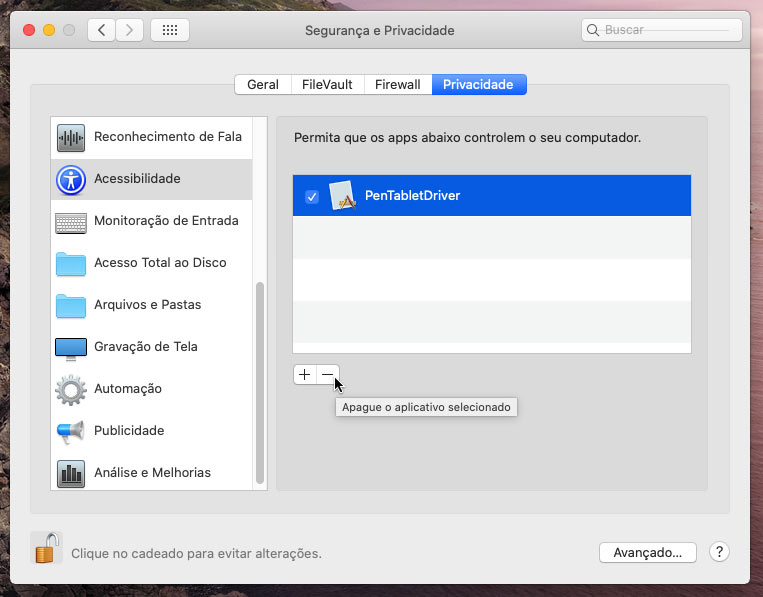
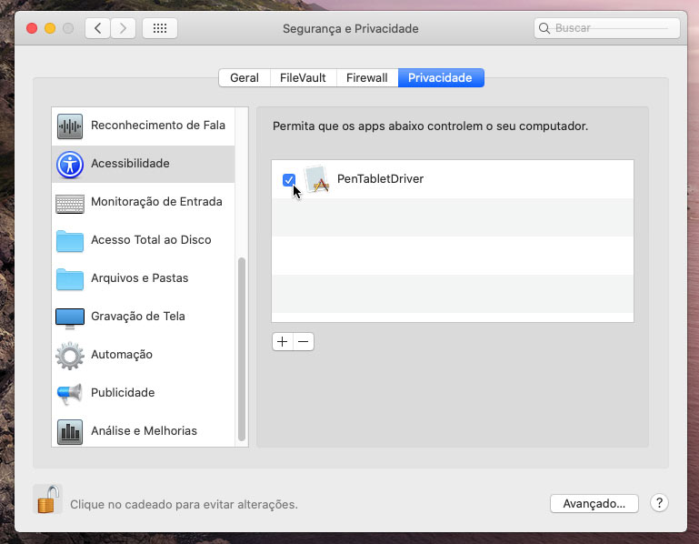

# Corrigido o driver Wacom Bamboo, Graphire, Intuos 3 e Cintiq 1st gen para o macOS Catalina

Os drivers da Wacom para seus mesa digitalizadora mais antigos não funcionam no macOS Catalina.
Eu criei uma versão fixa dos drivers para resolver o problema!

O driver Bamboo fixo (v5.3.7-6) suporta estes tablets:

- CTE-450, CTE-650 - Bamboo Fun / Bamboo Art Master (2007)
- CTE-460 - Bamboo One Pen
- CTF-430 - Bamboo One
- CTH-300, CTH300, CTH301K - Bamboo Pad
- CTH-460, CTH-660 - Bamboo Pen and Touch
- CTH-461 - Bamboo Fun Pen and Touch / Bamboo Craft / Bamboo Fun Special Edition
- CTH-470 - Bamboo Capture / Bamboo Pen & Touch / Bamboo Create
- CTH-661 - Bamboo Fun / Bamboo Art Master (2009) / Bamboo Fun Pen and Touch
- CTH-670 - Bamboo Create
- CTL-460, CTL-660 - Bamboo Pen 
- CTL-470 - Bamboo Connect / Bamboo Pen
- CTT-460 - Bamboo Touch
- MTE-450 - Bamboo

O driver Graphire 3 fixo (v5.2.6-5) suporta estes tablets:

- CTE-430, CTE-630 - Graphire 3

O driver Graphire 4 fixo (v5.3.0-3) suporta estes tablets:

- CTE-440, CTE-640 - Graphire 4
- CTE-630BT - Graphire 3 Wireless (untested)

O driver Intuos e Cintiq fixo (v6.3.15-3) suporta estes tablets:

- PTZ-430, PTZ-630, PTZ-630SE, PTZ-631W, PTZ-930, PTZ-1230, PTZ-1231W - Intuos 3
- DTZ-2100 - Cintiq 21UX 1st Gen.
- DTZ-2000 - Cintiq 20WSX

[🇳🇿 English instructions](Readme.md)   
[🇦🇺 Simplified English instructions](Readme.en-simple.md)   
[🇯🇵 日本語で表示](Readme.ja-JP.md)   
[🇷🇺 Инструкция на русском языке](Readme.ru-RU.md)   

## Instalação do driver

Faça o download o instalador correto:

- [Driver v6.1.6-4 para Graphire 1 e 2](https://github.com/thenickdude/wacom-driver-fix/releases/download/patch-6/Install-Wacom-Tablet-6.1.6-4-patched.pkg)
- [Driver v5.2.6-5 para Graphire 3](https://github.com/thenickdude/wacom-driver-fix/releases/download/patch-6/Install-Wacom-Tablet-5.2.6-5-patched.pkg)
- [Driver v5.3.0-3 para Graphire 4](https://github.com/thenickdude/wacom-driver-fix/releases/download/patch-6/Install-Wacom-Tablet-5.3.0-3-patched.pkg)
- [Driver v5.3.7-6 para Bamboo](https://github.com/thenickdude/wacom-driver-fix/releases/download/patch-6/Install-Wacom-Tablet-5.3.7-6-patched.pkg)
- [Driver v6.3.15-13 para Intuos 3 e Cintiq](https://github.com/thenickdude/wacom-driver-fix/releases/download/patch-6/Install-Wacom-Tablet-6.3.15-3-patched.pkg)

Execute o instalador para instalar o driver.

Depois, remova as permissões de driver desatualizadas:

- Vá para o menu Apple, abra Preferências do Sistema e selecione Segurança & Privacidade
- Vá para a guia Privacidade, selecione Acessibilidade e clique no cadeado na parte inferior das preferências para fazer alterações. Você será solicitado a inserir suas credenciais.
- Selecione qualquer item da Wacom (PenTabletDriver, ConsumerTouchDriver, WacomTabletSpringboard, etc) e clique no sinal "-" abaixo da lista para removê-los.
- Faça o mesmo na guia "Monitoramento de entrada" 
- Reinicie o computador

Segundo, adicione as novas permissões de driver:

- Toque a caneta no mesa digitalizadora
- Vá para o menu Apple, abra Preferências do Sistema e selecione Segurança & Privacidade
- Vá para a guia Privacidade, selecione Acessibilidade e clique no cadeado na parte inferior das preferências para fazer alterações. Você será solicitado a inserir suas credenciais.
- Na lista exibida, verifique se qualquer componente da lista Wacom tem uma marca de seleção.
- Faça o mesmo na guia "Monitoramento de entrada" 

O mesa digitalizadora deve estar funcionando corretamente agora!

## Me ajude

Se você gostou do seu mesa digitalizadora de volta à ação, considere me enviar uma dica!

 

Sua doação ajudará a apoiar o desenvolvimento.